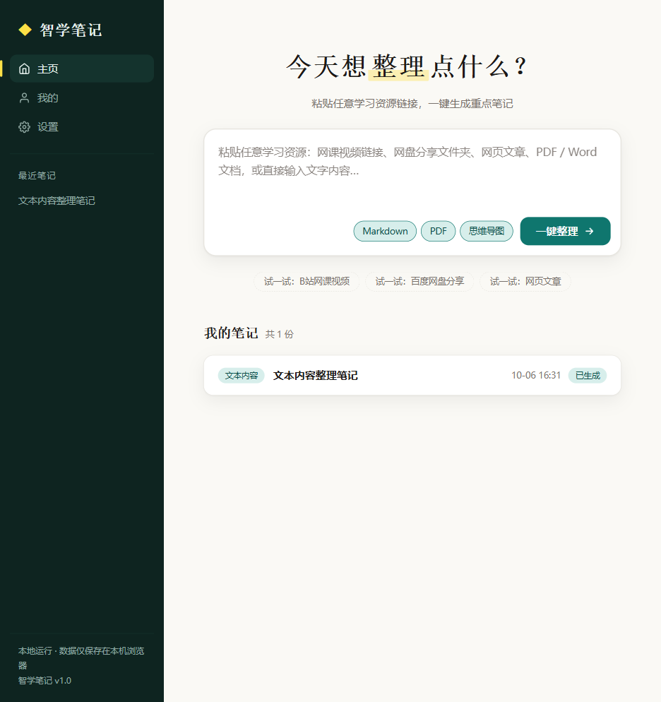
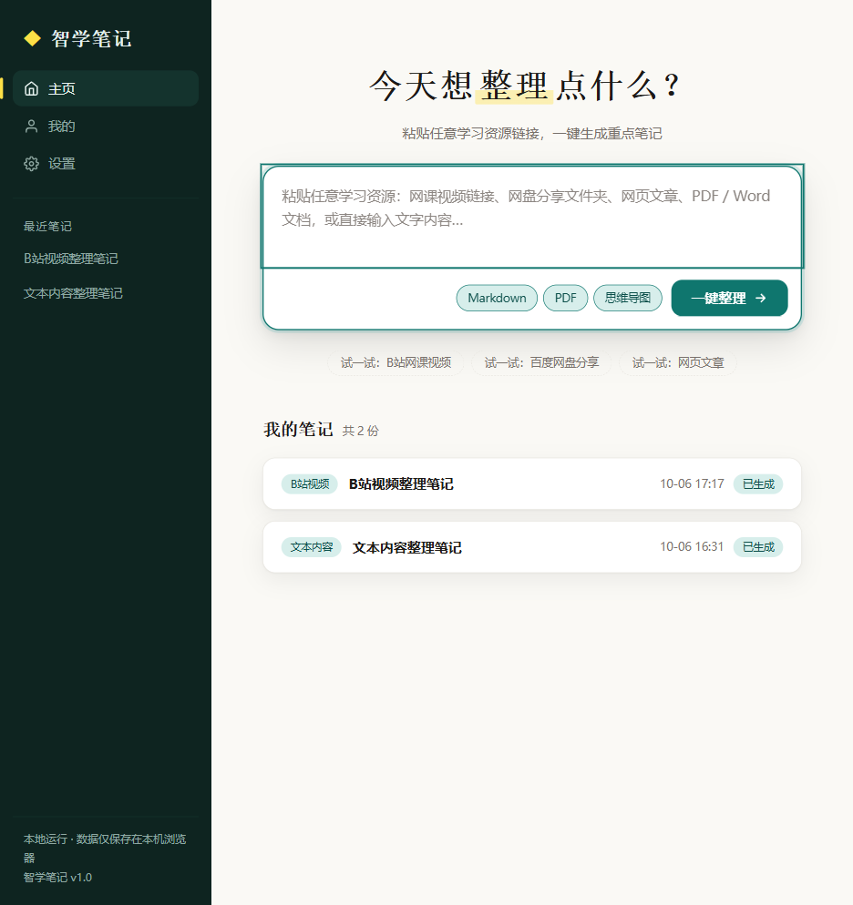
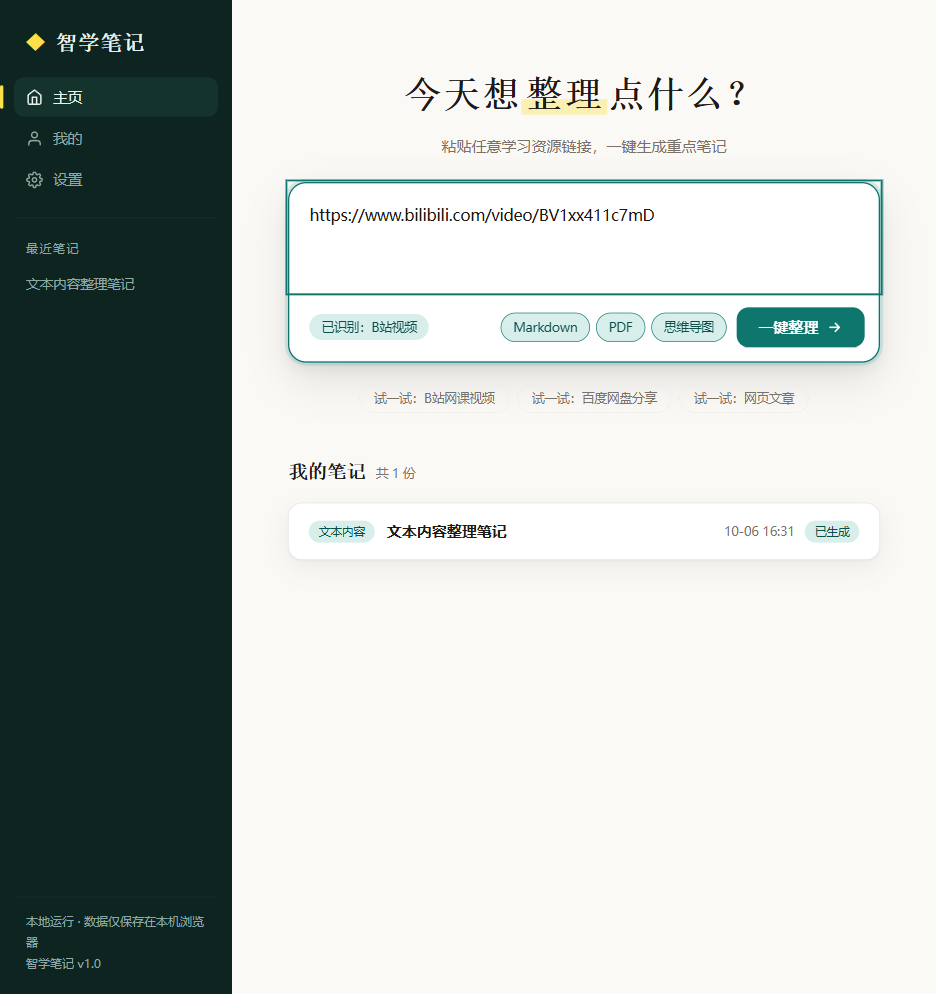
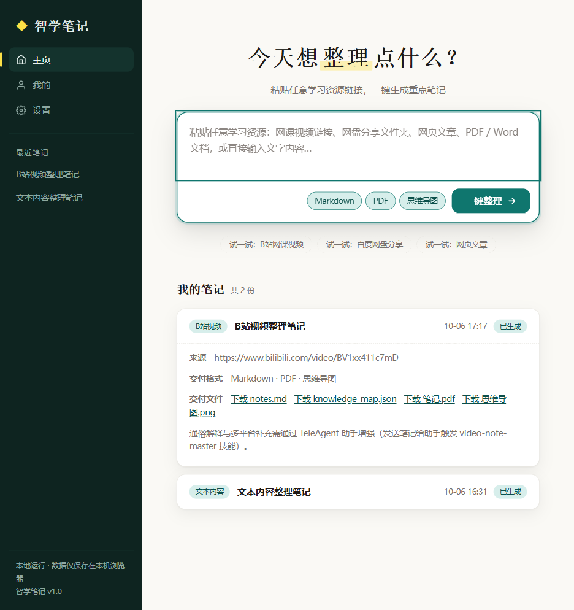

---
AIGC:
  ContentProducer: '001191110102MAD55U9H0F10002'
  ContentPropagator: '001191110102MAD55U9H0F10002'
  Label: '1'
  ProduceID: '78d633fd-6a8a-4929-9f21-4719ed6f8bfc'
  PropagateID: '78d633fd-6a8a-4929-9f21-4719ed6f8bfc'
  ReservedCode1: 'c4087769-4cf8-461b-8bc8-23b8ef8d6a9e'
  ReservedCode2: 'c4087769-4cf8-461b-8bc8-23b8ef8d6a9e'
---

# 智学笔记 (ZhiXue Notes)

<div align="center">

**输入任意学习资源链接，一键生成重点笔记 + PDF + 思维导图**

本地运行 · 隐私安全 · AI 增强 · 零框架依赖

[](https://github.com/Yan120307/zhixue-notes/stargazers)
[](https://github.com/Yan120307/zhixue-notes/network)
[](./LICENSE)
[](https://www.python.org/)
[](https://developer.mozilla.org/)
[]()
[]()
[](https://github.com/Yan120307/zhixue-notes/issues)

**[功能特性](#-功能特性) · [效果展示](#-效果展示) · [快速开始](#-快速开始) · [配置大模型](#-配置大模型可选) · [学习工具集成](#-学习工具集成) · [API 文档](#-api-文档) · [路线图](#-路线图)**

</div>

---

## ✨ 功能特性

### 核心能力
- **任意链接自动识别** — 粘贴任何链接（或含链接的分享消息）都能提取并识别：视频 / 网盘 / 网页 / 文档，自动选择处理方式
- **无字幕视频本地转写** — 检测到视频无 CC 字幕时弹窗征得同意后，下载音频 → 本地 faster-whisper 转写（不上传任何内容）→ 笔记生成后自动删除音频文件
- **网页正文提取** — 零依赖正文抓取器，自动剔除导航/广告/评论噪声
- **智能提炼** — 有时间轴按章节分段、无时间轴按内容分章，结构化知识图谱 + 原文摘录（自动去重）
- **字幕自动抓取** — B站 WBI API 字幕抓取 + YouTube yt-dlp 自动字幕，无需手动下载
- **AI 通俗解释**（可选） — 接入通义千问 / OpenAI，每个知识点生成「一句话掌握」+「生活化通俗解释」
- **AI 考点提炼**（可选） — 自动生成 5-8 个必背考点清单
- **失败诚实提示** — 内容不足/需要确认时明确说明，绝不生成空壳笔记

### 交付格式（四件套）
| 格式 | 说明 |
|---|---|
| **Markdown** | 结构化笔记源文件 |
| **PDF** | 中文友好排版，内嵌截图与表格 |
| **思维导图 PNG** | 横向树布局，按章节自动配色 |
| **Anki 卡片 TSV** | 知识点自动制卡，导入即背 |

### 学习工具链
- **Anki 间隔记忆** — 笔记卡片一键导出 TSV，Anki 导入即开始间隔重复
- **Obsidian 知识库** — 一键写入 Vault，自动生成 MOC 索引页
- **视频关键帧截图** — 安装 playwright 后自动启用，重点画面嵌入 PDF
- **网盘文件浏览** — 网盘分享链接自动列出文件清单

### 平台特色
- **简洁大气 UI** — 浅/深双主题、响应式布局、荧光笔签名设计
- **笔记在线预览** — 点击即在弹窗中阅读完整笔记
- **历史搜索** — 按标题/来源/类型即时筛选
- **本地优先** — localStorage 持久化 + 本地 Python 后端，数据不出本机

## 📸 效果展示

| 主页输入 | 整理流水线 |
|:---:|:---:|
|  |  |

| 资源识别 | 笔记交付 |
|:---:|:---:|
|  |  |

> 更多截图见 [docs/images/](docs/images/)

## 🚀 快速开始

### 环境要求

- Python 3.8+（Docker 部署可跳过 Python）
- 现代浏览器（Chrome / Edge / Firefox）

### 方式一：Docker 一键部署（推荐）

```bash
git clone https://github.com/Yan120307/zhixue-notes.git
cd zhixue-notes
docker compose up -d
# 浏览器打开 http://localhost:8765
```

### 方式二：Windows 一键启动

双击 `start.bat`：自动检测依赖 → 启动前后端 → 自动打开浏览器

> 自动探测 Python（py 启动器 → python/python3 命令 → 常见安装路径）；
> 也可用环境变量 `ZHIXUE_PYTHON` 指定 python.exe 完整路径（适合便携版/嵌入式 Python）

### 方式三：手动启动（全平台）

```bash
# 1. 克隆仓库
git clone https://github.com/Yan120307/zhixue-notes.git
cd zhixue-notes

# 2. 安装依赖
pip install -r requirements.txt

# 3. 启动后端服务
cd backend && python server.py

# 4. 另开终端，启动前端
cd frontend && python -m http.server 8765
# 浏览器打开 http://localhost:8765
```

> 也可以直接双击 `frontend/index.html` 打开（无需启动前端服务器，但需保持后端运行）

### 使用

1. 在主页输入框粘贴学习资源（支持：有 CC 字幕的 B站/YouTube 视频、网页文章链接，或直接粘贴大段文字）
2. 系统自动识别资源类型，抓取内容并分章提炼
3. 点击「**一键整理**」，等待流水线完成
4. 笔记卡片展开后即可下载所有文件，标题/章节/要点均来自真实内容
5. 按需点击「**导出 Anki**」生成记忆卡片，或「**写入 Obsidian**」同步到知识库

> 提示：B站大部分教学视频没有 CC 字幕（需 UP 主上传），遇到无字幕视频会明确提示；此时可复制视频文稿粘贴到输入框，效果同样好

## 🤖 配置大模型（可选）

配置后可获得 AI 通俗解释 + 考点提炼。未配置时自动降级为基础提炼，不影响使用。

### 方式一：通义千问（推荐国内用户）

```bash
# 获取 API Key: https://bailian.console.aliyun.com/ → API-KEY 管理 → 创建
# Windows PowerShell
$env:DASHSCOPE_API_KEY = "sk-你的Key"

# Linux/macOS
export DASHSCOPE_API_KEY="sk-你的Key"
```

### 方式二：OpenAI

```bash
export OPENAI_API_KEY="sk-你的Key"
# 可选：切换模型
export ZHIXUE_LLM_MODEL="gpt-4o-mini"
```

配置后重启 `server.py`，整理时流水线会显示「大模型增强中」，笔记将包含：
- **一句话掌握**：用一句大白话概括每个知识点
- **通俗解释**：生活化类比 + 零基础友好
- **必背考点**：AI 生成的考试重点清单

## 🧩 学习工具集成

### Anki 卡片导出

- 整理时在格式选项勾选「Anki 卡片」，或在任意笔记卡片点击「**导出 Anki**」
- 生成 TSV 文件，在 Anki 中「文件 → 导入」选择该 TSV 即可开始间隔重复记忆

### Obsidian Vault 写入

- 在「设置 → Obsidian 集成」填入 Vault 本地路径（如 `D:\MyVault`），或首次点击时输入
- 点击笔记卡片「**写入 Obsidian**」，笔记与 MOC 索引页会写入 Vault 下的 `ZhixueNotes/` 目录

### 可选增强（安装后自动启用）

```bash
# 无字幕视频本地转写（推荐，约 6 分钟转完 15 分钟视频）
pip install faster-whisper

# 视频关键帧截图 + 网盘文件浏览
pip install playwright && playwright install chromium
```

- **无字幕视频转写**：B站视频无 CC 字幕时自动下载音频流，用 faster-whisper 在本地转写（零联网上传，隐私安全），全程进度可视；高频术语自动校正（进制/函数/次方等）
- **视频关键帧截图**：整理视频时自动截取重点画面并嵌入 PDF
- **网盘文件浏览**：网盘分享链接自动列出文件清单（需提取码的除外）

> 未安装不影响其他功能：无字幕视频会明确提示安装方法，其余类型正常使用

## 📖 API 文档

| 接口 | 方法 | 说明 |
|---|---|---|
| `/api/process` | POST | 启动整理任务，body: `{"url": "...", "fmts": ["md","pdf","mindmap"]}` |
| `/api/status?id=` | GET | 轮询任务状态与进度日志 |
| `/api/files/{id}/{filename}` | GET | 下载结果文件（md/pdf/png/json） |
| `/api/notes` | GET | 列出所有已完成笔记 |
| `/api/read?id=&file=notes.md` | GET | 读取笔记内容（在线预览用） |
| `/api/export/anki` | POST | 按需生成 Anki 卡片，body: `{"id": "..."}` |
| `/api/export/obsidian` | POST | 写入 Obsidian Vault，body: `{"id": "...", "vault": "D:\\MyVault", "folder": "ZhixueNotes"}` |

<details>
<summary>展开查看 API 调用示例</summary>

```bash
# 启动整理任务
curl -X POST http://localhost:8766/api/process \
  -H "Content-Type: application/json" \
  -d '{"url": "https://www.bilibili.com/video/BV1xx411c7mD", "fmts": ["md", "pdf", "mindmap"]}'

# 返回 {"task_id": "tabc123...", "type": {...}}

# 查询状态
curl http://localhost:8766/api/status?id=tabc123

# 下载 PDF
curl -o 笔记.pdf http://localhost:8766/api/files/tabc123/notes.pdf
```

</details>

## 🏗️ 项目结构

```
zhixue-notes/
├── frontend/
│   └── index.html              # 平台前端（纯原生 HTML/CSS/JS，零依赖）
├── backend/
│   ├── server.py               # Python REST API（字幕抓取+提炼+导出）
│   └── llm.py                  # 大模型模块（通义千问/OpenAI 兼容）
├── scripts/
│   ├── fetch_subtitles.py      # 多平台字幕抓取（B站 WBI / yt-dlp）
│   ├── export_pdf.py           # Markdown → PDF（reportlab，中文友好）
│   ├── gen_mindmap.py          # 知识图谱 → 思维导图 PNG（matplotlib）
│   ├── screenshot_keyframes.py # 视频关键帧截图（playwright）
│   ├── export_anki.py          # 知识图谱 → Anki 卡片 TSV
│   ├── export_obsidian.py      # 笔记写入 Obsidian Vault
│   └── browse_pan.py           # 网盘分享文件清单浏览
├── start.bat                   # Windows 一键启动
├── Dockerfile                  # Docker 构建
├── docker-compose.yml          # Docker 编排
├── requirements.txt            # Python 依赖
├── docs/
│   ├── images/                 # README 截图
│   └── 上线可行性分析.md        # 上线方案分析（网站/小程序/GitHub）
├── README.md
├── LICENSE
└── .gitignore
```

## 🛠️ 技术栈

| 层 | 技术 |
|---|---|
| 前端 | HTML5 + CSS3 + 原生 JS（零框架、零依赖、单文件） |
| 后端 | Python 标准库 `http.server` + `threading` |
| LLM | 通义千问 DashScope / OpenAI 兼容接口（`urllib`，无需 SDK） |
| PDF | ReportLab（中文字体自动探测：微软雅黑→黑体→宋体→CID） |
| 思维导图 | Matplotlib（横向树 + 贝塞尔连线 + 黄金角配色） |
| 字幕 | requests + B站 WBI 签名 / yt-dlp |
| Anki | 知识图谱 → TSV 制卡（零依赖） |
| Obsidian | Vault Markdown 写入 + MOC 索引（零依赖） |
| 部署 | start.bat 一键启动 / Docker Compose |

## 🗺️ 路线图

- [x] 多类型资源输入（视频/网盘/文档/网页/文本）
- [x] 字幕自动抓取（B站/YouTube）
- [x] 基础提炼（分章节 + 关键句）
- [x] 三件套导出（Markdown + PDF + 思维导图）
- [x] 大模型增强（通义千问/OpenAI 通俗解释 + 考点）
- [x] 笔记在线预览 + 历史搜索
- [x] 浅/深双主题
- [x] Docker 一键部署
- [x] 视频关键帧自动截图（Playwright 集成，安装即用）
- [x] 网盘文件夹批量浏览
- [x] Anki 卡片导出
- [x] Obsidian Vault 直接写入
- [x] 无字幕视频本地转写（faster-whisper）
- [x] 整理进度可视化（总进度条 + 步骤指示 + 实时耗时）
- [ ] 浏览器插件（一键收藏当前页面）
- [ ] 多 P 视频整合集整理

## 🤝 贡献指南

欢迎 Issue / PR！

1. Fork 本仓库
2. 创建分支：`git checkout -b feature/amazing`
3. 提交更改：`git commit -m "Add amazing feature"`
4. 推送分支：`git push origin feature/amazing`
5. 提交 Pull Request

## 📄 License

[MIT](./LICENSE) © 2026 智学笔记

## 🙏 致谢

- 字幕抓取参考 [BiliNote](https://github.com/JefferyHcool/BiliNote) 的 WBI 签名方案
- PDF 导出基于 [ReportLab](https://www.reportlab.com/)
- 思维导图基于 [Matplotlib](https://matplotlib.org/)
- 设计灵感来自 Ai好记、BiliNote、NoteGPT 等产品

---

<div align="center">

如果这个项目对你有帮助，欢迎点一个 **Star** ⭐ 让更多人看到！

**[⭐ Star](https://github.com/Yan120307/zhixue-notes/stargazers) · [🍴 Fork](https://github.com/Yan120307/zhixue-notes/fork) · [📢 Issue](https://github.com/Yan120307/zhixue-notes/issues)**

</div>

> AI生成